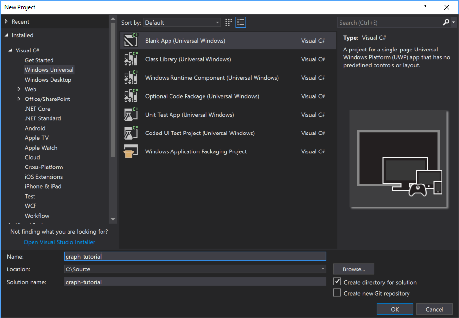

<!-- markdownlint-disable MD002 MD041 -->

打开 Visual Studio, 然后选择 "**文件" > "新建 > 项目**"。 在 "**新建项目**" 对话框中, 执行以下操作:

1. 在**Visual c # > Windows 通用 >** 中选择 "模板"。
1. 选择**空白应用 (通用窗口)**。
1. 输入**graph-** 项目名称教程。



> [!IMPORTANT]
> 确保为在这些实验室说明中指定的 Visual Studio 项目输入完全相同的名称。 Visual Studio 项目名称将成为代码中的命名空间的一部分。 这些指令中的代码取决于与这些说明中指定的 Visual Studio 项目名称匹配的命名空间。 如果使用其他项目名称, 则代码将不会编译, 除非您调整所有命名空间以匹配您在创建项目时输入的 Visual Studio 项目名称。

选择“确定”****。 在 "**新建通用 Windows 平台项目**" 对话框中, 确保将**最低版本**设置为`Windows 10 Fall Creators Update (10.0; Build 16299)`或更高, 然后选择 **"确定"**。

在继续之前, 请安装稍后将使用的一些其他 NuGet 包。

- 用于添加应用程序内通知和加载指示器的一些 UI 控件的[控件](https://www.nuget.org/packages/Microsoft.Toolkit.Uwp.Ui.Controls/)。
- [](https://www.nuget.org/packages/Microsoft.Toolkit.Uwp.Ui.Controls.DataGrid/)若要显示 microsoft Graph 返回的信息, 则为。
- 用于处理登录和访问令牌检索的[Microsoft 工具包](https://www.nuget.org/packages/Microsoft.Toolkit.Uwp.Ui.Controls.Graph/)。
- 用于调用 Microsoft Graph 的[microsoft](https://www.nuget.org/packages/Microsoft.Graph/) graph。

选择 "**工具" > NuGet 包管理器 "> 程序包管理器控制台**"。 在 "程序包管理器控制台" 中, 输入以下命令。

```Powershell
Install-Package Microsoft.Toolkit.Uwp.Ui.Controls
Install-Package Microsoft.Toolkit.Uwp.Ui.Controls.DataGrid
Install-Package Microsoft.Toolkit.Uwp.Ui.Controls.Graph
Install-Package Microsoft.Graph
```

## <a name="design-the-app"></a>设计应用程序

首先添加应用程序级变量以跟踪身份验证状态。 在 "解决方案资源管理器" 中, 展开**app.xaml**并打开**App.xaml.cs**。 将以下属性添加到`App`类中。

```cs
public bool IsAuthenticated { get; set; }
```

接下来, 定义主页面的布局。 打开`MainPage.xaml`并将其全部内容替换为以下内容。

```xml
<Page
    x:Class="graph_tutorial.MainPage"
    xmlns="http://schemas.microsoft.com/winfx/2006/xaml/presentation"
    xmlns:x="http://schemas.microsoft.com/winfx/2006/xaml"
    xmlns:local="using:graph_tutorial"
    xmlns:d="http://schemas.microsoft.com/expression/blend/2008"
    xmlns:mc="http://schemas.openxmlformats.org/markup-compatibility/2006"
    xmlns:controls="using:Microsoft.Toolkit.Uwp.UI.Controls"
    xmlns:graphControls="using:Microsoft.Toolkit.Uwp.UI.Controls.Graph"
    mc:Ignorable="d"
    Background="{ThemeResource ApplicationPageBackgroundThemeBrush}">

    <Grid>
        <NavigationView x:Name="NavView"
            IsSettingsVisible="False"
            ItemInvoked="NavView_ItemInvoked">

            <NavigationView.Header>
                <graphControls:AadLogin x:Name="Login"
                    HorizontalAlignment="Left"
                    View="SmallProfilePhotoLeft"
                    AllowSignInAsDifferentUser="False"
                    />
            </NavigationView.Header>

            <NavigationView.MenuItems>
                <NavigationViewItem Content="Home" x:Name="Home" Tag="home">
                    <NavigationViewItem.Icon>
                        <FontIcon Glyph="&#xE10F;"/>
                    </NavigationViewItem.Icon>
                </NavigationViewItem>
                <NavigationViewItem Content="Calendar" x:Name="Calendar" Tag="calendar">
                    <NavigationViewItem.Icon>
                        <FontIcon Glyph="&#xE163;"/>
                    </NavigationViewItem.Icon>
                </NavigationViewItem>
            </NavigationView.MenuItems>

            <StackPanel>
                <controls:InAppNotification x:Name="Notification" ShowDismissButton="true" />
                <Frame x:Name="RootFrame" Margin="24, 0" />
            </StackPanel>
        </NavigationView>
    </Grid>
</Page>
```

这将定义基本[NavigationView](https://docs.microsoft.com/uwp/api/windows.ui.xaml.controls.navigationview) , 并使用**Home**和**Calendar**导航链接充当应用程序的主视图。 此外, 它还会在视图的标题中添加一个[AadLogin](https://docs.microsoft.com/dotnet/api/microsoft.toolkit.uwp.ui.controls.graph.aadlogin?view=win-comm-toolkit-dotnet-stable)控件。 该控件将允许用户登录和注销。该控件尚未完全启用, 你将在后续练习中对其进行配置。

现在, 为 "主页" 视图添加另一个 XAML 页面。 右键单击 "解决方案资源管理器" 中的 "**教程**" 项目, 然后选择 "**添加 > 新项 ...**"。选择 "**空白页**" `HomePage.xaml` , 在 "**名称**" 字段中输入, 然后选择 "**添加**"。 将下面的代码添加到`<Grid>`文件中的元素内。

```xml
<StackPanel>
    <TextBlock FontSize="44" FontWeight="Bold" Margin="0, 12">Microsoft Graph UWP Tutorial</TextBlock>
    <TextBlock x:Name="HomePageMessage">Please sign in to continue.</TextBlock>
</StackPanel>
```

现在, **** 展开 "解决方案资源管理器" 中`MainPage.xaml.cs`的 MainPage, 然后打开。 将下面的代码添加到`MainPage()`构造函数中`this.InitializeComponent();`的行**后面**。

```cs
// Initialize auth state to false
SetAuthState(false);

// Navigate to HomePage.xaml
RootFrame.Navigate(typeof(HomePage));
```

当应用程序第一次启动时, 它会将身份`false`验证状态初始化为并导航到主页。

将以下函数添加到`MainPage`类以管理身份验证状态。

```cs
private void SetAuthState(bool isAuthenticated)
{
    (App.Current as App).IsAuthenticated = isAuthenticated;

    // Toggle controls that require auth
    Calendar.IsEnabled = isAuthenticated;
}
```

添加以下事件处理程序, 以便在用户从导航视图中选择项目时加载请求的页面。

```cs
private void NavView_ItemInvoked(NavigationView sender, NavigationViewItemInvokedEventArgs args)
{
    var invokedItem = args.InvokedItem as string;

    switch (invokedItem.ToLower())
    {
        case "calendar":
            throw new NotImplementedException();
            break;
        case "home":
        default:
            RootFrame.Navigate(typeof(HomePage));
            break;
    }
}
```

保存所有更改, 然后按**F5**或选择调试 > 在 Visual Studio 中**启动调试**。

> [!NOTE]
> 确保为您的计算机选择适当的配置 (ARM、x64、x86)。


