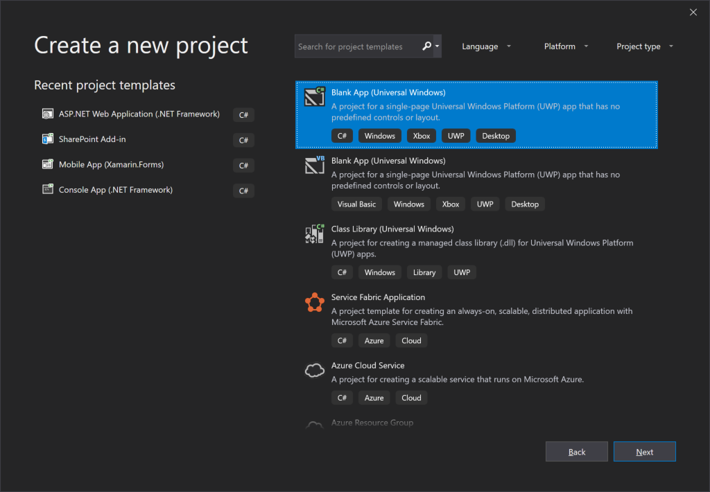
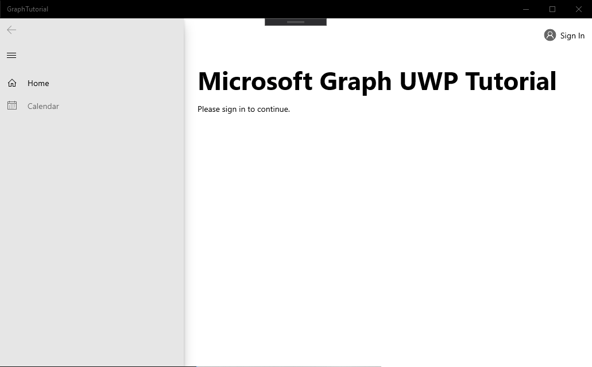

<!-- markdownlint-disable MD002 MD041 -->

<span data-ttu-id="bb4d8-101">打开 Visual Studio, 然后选择 "**新建项目**"。</span><span class="sxs-lookup"><span data-stu-id="bb4d8-101">Open Visual Studio, and select **Create a new project**.</span></span> <span data-ttu-id="bb4d8-102">选择使用 c # 的**空白应用程序 (通用窗口)** 选项, 然后选择 "**下一步**"。</span><span class="sxs-lookup"><span data-stu-id="bb4d8-102">Choose the **Blank App (Universal Windows)** option that uses C#, then select **Next**.</span></span>



<span data-ttu-id="bb4d8-104">在 "**配置新项目**" 对话框中, `graph-tutorial`在 "**项目名称**" 字段中输入, 然后选择 "**创建**"。</span><span class="sxs-lookup"><span data-stu-id="bb4d8-104">In the **Configure your new project** dialog, enter `graph-tutorial` in the **Project name** field and select **Create**.</span></span>


> [!IMPORTANT]
> <span data-ttu-id="bb4d8-106">确保为在这些实验室说明中指定的 Visual Studio 项目输入完全相同的名称。</span><span class="sxs-lookup"><span data-stu-id="bb4d8-106">Ensure that you enter the exact same name for the Visual Studio Project that is specified in these lab instructions.</span></span> <span data-ttu-id="bb4d8-107">Visual Studio 项目名称将成为代码中的命名空间的一部分。</span><span class="sxs-lookup"><span data-stu-id="bb4d8-107">The Visual Studio Project name becomes part of the namespace in the code.</span></span> <span data-ttu-id="bb4d8-108">这些指令中的代码取决于与这些说明中指定的 Visual Studio 项目名称匹配的命名空间。</span><span class="sxs-lookup"><span data-stu-id="bb4d8-108">The code inside these instructions depends on the namespace matching the Visual Studio Project name specified in these instructions.</span></span> <span data-ttu-id="bb4d8-109">如果使用其他项目名称, 则代码将不会编译, 除非您调整所有命名空间以匹配您在创建项目时输入的 Visual Studio 项目名称。</span><span class="sxs-lookup"><span data-stu-id="bb4d8-109">If you use a different project name the code will not compile unless you adjust all the namespaces to match the Visual Studio Project name you enter when you create the project.</span></span>

<span data-ttu-id="bb4d8-110">选择“确定”\*\*\*\*。</span><span class="sxs-lookup"><span data-stu-id="bb4d8-110">Select **OK**.</span></span> <span data-ttu-id="bb4d8-111">在 "**新建通用 Windows 平台项目**" 对话框中, 确保将**最低版本**设置为`Windows 10 Fall Creators Update (10.0; Build 16299)`或更高, 然后选择 **"确定"**。</span><span class="sxs-lookup"><span data-stu-id="bb4d8-111">In the **New Universal Windows Platform Project** dialog, ensure that the **Minimum version** is set to `Windows 10 Fall Creators Update (10.0; Build 16299)` or later and select **OK**.</span></span>

<span data-ttu-id="bb4d8-112">在继续之前, 请安装稍后将使用的一些其他 NuGet 包。</span><span class="sxs-lookup"><span data-stu-id="bb4d8-112">Before moving on, install some additional NuGet packages that you will use later.</span></span>

- <span data-ttu-id="bb4d8-113">用于添加应用程序内通知和加载指示器的一些 UI 控件的[控件](https://www.nuget.org/packages/Microsoft.Toolkit.Uwp.Ui.Controls/)。</span><span class="sxs-lookup"><span data-stu-id="bb4d8-113">[Microsoft.Toolkit.Uwp.Ui.Controls](https://www.nuget.org/packages/Microsoft.Toolkit.Uwp.Ui.Controls/) to add some UI controls for in-app notifications and loading indicators.</span></span>
- <span data-ttu-id="bb4d8-114">[](https://www.nuget.org/packages/Microsoft.Toolkit.Uwp.Ui.Controls.DataGrid/)若要显示 microsoft Graph 返回的信息, 则为。</span><span class="sxs-lookup"><span data-stu-id="bb4d8-114">[Microsoft.Toolkit.Uwp.Ui.Controls.DataGrid](https://www.nuget.org/packages/Microsoft.Toolkit.Uwp.Ui.Controls.DataGrid/) to display the information returned by Microsoft Graph.</span></span>
- <span data-ttu-id="bb4d8-115">用于处理登录和访问令牌检索的[Microsoft 工具包](https://www.nuget.org/packages/Microsoft.Toolkit.Uwp.Ui.Controls.Graph/)。</span><span class="sxs-lookup"><span data-stu-id="bb4d8-115">[Microsoft.Toolkit.Uwp.Ui.Controls.Graph](https://www.nuget.org/packages/Microsoft.Toolkit.Uwp.Ui.Controls.Graph/) to handle login and access token retrieval.</span></span>
- <span data-ttu-id="bb4d8-116">用于调用 Microsoft Graph 的[microsoft](https://www.nuget.org/packages/Microsoft.Graph/) graph。</span><span class="sxs-lookup"><span data-stu-id="bb4d8-116">[Microsoft.Graph](https://www.nuget.org/packages/Microsoft.Graph/) for making calls to the Microsoft Graph.</span></span>

<span data-ttu-id="bb4d8-117">选择 "**工具" > NuGet 包管理器 "> 程序包管理器控制台**"。</span><span class="sxs-lookup"><span data-stu-id="bb4d8-117">Select **Tools > NuGet Package Manager > Package Manager Console**.</span></span> <span data-ttu-id="bb4d8-118">在 "程序包管理器控制台" 中, 输入以下命令。</span><span class="sxs-lookup"><span data-stu-id="bb4d8-118">In the Package Manager Console, enter the following commands.</span></span>

```Powershell
Install-Package Microsoft.Toolkit.Uwp.Ui.Controls -Version 5.1.1
Install-Package Microsoft.Toolkit.Uwp.Ui.Controls.DataGrid -Version 5.1.0
Install-Package Microsoft.Toolkit.Uwp.Ui.Controls.Graph -Version 5.1.0
Install-Package Microsoft.Graph -Version 1.16.0
```

## <a name="design-the-app"></a><span data-ttu-id="bb4d8-119">设计应用程序</span><span class="sxs-lookup"><span data-stu-id="bb4d8-119">Design the app</span></span>

<span data-ttu-id="bb4d8-120">首先添加应用程序级变量以跟踪身份验证状态。</span><span class="sxs-lookup"><span data-stu-id="bb4d8-120">Start by adding an application-level variable to track authentication state.</span></span> <span data-ttu-id="bb4d8-121">在 "解决方案资源管理器" 中, 展开**app.xaml**并打开**App.xaml.cs**。</span><span class="sxs-lookup"><span data-stu-id="bb4d8-121">In Solution Explorer, expand **App.xaml** and open **App.xaml.cs**.</span></span> <span data-ttu-id="bb4d8-122">将以下属性添加到`App`类中。</span><span class="sxs-lookup"><span data-stu-id="bb4d8-122">Add the following property to the `App` class.</span></span>

```cs
public bool IsAuthenticated { get; set; }
```

<span data-ttu-id="bb4d8-123">接下来, 定义主页面的布局。</span><span class="sxs-lookup"><span data-stu-id="bb4d8-123">Next, define the layout for the main page.</span></span> <span data-ttu-id="bb4d8-124">打开`MainPage.xaml`并将其全部内容替换为以下内容。</span><span class="sxs-lookup"><span data-stu-id="bb4d8-124">Open `MainPage.xaml` and replace its entire contents with the following.</span></span>

```xml
<Page
    x:Class="graph_tutorial.MainPage"
    xmlns="http://schemas.microsoft.com/winfx/2006/xaml/presentation"
    xmlns:x="http://schemas.microsoft.com/winfx/2006/xaml"
    xmlns:local="using:graph_tutorial"
    xmlns:d="http://schemas.microsoft.com/expression/blend/2008"
    xmlns:mc="http://schemas.openxmlformats.org/markup-compatibility/2006"
    xmlns:controls="using:Microsoft.Toolkit.Uwp.UI.Controls"
    xmlns:graphControls="using:Microsoft.Toolkit.Uwp.UI.Controls.Graph"
    mc:Ignorable="d"
    Background="{ThemeResource ApplicationPageBackgroundThemeBrush}">

    <Grid>
        <NavigationView x:Name="NavView"
            IsSettingsVisible="False"
            ItemInvoked="NavView_ItemInvoked">

            <NavigationView.Header>
                <graphControls:AadLogin x:Name="Login"
                    HorizontalAlignment="Left"
                    View="SmallProfilePhotoLeft"
                    AllowSignInAsDifferentUser="False"
                    />
            </NavigationView.Header>

            <NavigationView.MenuItems>
                <NavigationViewItem Content="Home" x:Name="Home" Tag="home">
                    <NavigationViewItem.Icon>
                        <FontIcon Glyph="&#xE10F;"/>
                    </NavigationViewItem.Icon>
                </NavigationViewItem>
                <NavigationViewItem Content="Calendar" x:Name="Calendar" Tag="calendar">
                    <NavigationViewItem.Icon>
                        <FontIcon Glyph="&#xE163;"/>
                    </NavigationViewItem.Icon>
                </NavigationViewItem>
            </NavigationView.MenuItems>

            <StackPanel>
                <controls:InAppNotification x:Name="Notification" ShowDismissButton="true" />
                <Frame x:Name="RootFrame" Margin="24, 0" />
            </StackPanel>
        </NavigationView>
    </Grid>
</Page>
```

<span data-ttu-id="bb4d8-125">这将定义基本[NavigationView](https://docs.microsoft.com/uwp/api/windows.ui.xaml.controls.navigationview) , 并使用**Home**和**Calendar**导航链接充当应用程序的主视图。</span><span class="sxs-lookup"><span data-stu-id="bb4d8-125">This defines a basic [NavigationView](https://docs.microsoft.com/uwp/api/windows.ui.xaml.controls.navigationview) with **Home** and **Calendar** navigation links to act as the main view of the app.</span></span> <span data-ttu-id="bb4d8-126">此外, 它还会在视图的标题中添加一个[AadLogin](https://docs.microsoft.com/dotnet/api/microsoft.toolkit.uwp.ui.controls.graph.aadlogin?view=win-comm-toolkit-dotnet-stable)控件。</span><span class="sxs-lookup"><span data-stu-id="bb4d8-126">It also adds an [AadLogin](https://docs.microsoft.com/dotnet/api/microsoft.toolkit.uwp.ui.controls.graph.aadlogin?view=win-comm-toolkit-dotnet-stable) control in the header of the view.</span></span> <span data-ttu-id="bb4d8-127">该控件将允许用户登录和注销。该控件尚未完全启用, 你将在后续练习中对其进行配置。</span><span class="sxs-lookup"><span data-stu-id="bb4d8-127">That control will allow the user to sign in and out. The control isn't fully enabled yet, you will configure it in a later exercise.</span></span>

<span data-ttu-id="bb4d8-128">现在, 为 "主页" 视图添加另一个 XAML 页面。</span><span class="sxs-lookup"><span data-stu-id="bb4d8-128">Now add another XAML page for the Home view.</span></span> <span data-ttu-id="bb4d8-129">右键单击 "解决方案资源管理器" 中的 "**教程**" 项目, 然后选择 "**添加 > 新项 ...**"。选择 "**空白页**" `HomePage.xaml` , 在 "**名称**" 字段中输入, 然后选择 "**添加**"。</span><span class="sxs-lookup"><span data-stu-id="bb4d8-129">Right-click the **graph-tutorial** project in Solution Explorer and select **Add > New Item...**. Choose **Blank Page**, enter `HomePage.xaml` in the **Name** field, and select **Add**.</span></span> <span data-ttu-id="bb4d8-130">将下面的代码添加到`<Grid>`文件中的元素内。</span><span class="sxs-lookup"><span data-stu-id="bb4d8-130">Add the following code inside the `<Grid>` element in the file.</span></span>

```xml
<StackPanel>
    <TextBlock FontSize="44" FontWeight="Bold" Margin="0, 12">Microsoft Graph UWP Tutorial</TextBlock>
    <TextBlock x:Name="HomePageMessage">Please sign in to continue.</TextBlock>
</StackPanel>
```

<span data-ttu-id="bb4d8-131">现在, \*\*\*\* 展开 "解决方案资源管理器" 中`MainPage.xaml.cs`的 MainPage, 然后打开。</span><span class="sxs-lookup"><span data-stu-id="bb4d8-131">Now expand **MainPage.xaml** in Solution Explorer and open `MainPage.xaml.cs`.</span></span> <span data-ttu-id="bb4d8-132">将以下函数添加到`MainPage`类以管理身份验证状态。</span><span class="sxs-lookup"><span data-stu-id="bb4d8-132">Add the following function to the `MainPage` class to manage authentication state.</span></span>

```cs
private void SetAuthState(bool isAuthenticated)
{
    (App.Current as App).IsAuthenticated = isAuthenticated;

    // Toggle controls that require auth
    Calendar.IsEnabled = isAuthenticated;
}
```

<span data-ttu-id="bb4d8-133">将下面的代码添加到`MainPage()`构造函数中`this.InitializeComponent();`的行**后面**。</span><span class="sxs-lookup"><span data-stu-id="bb4d8-133">Add the following code to the `MainPage()` constructor **after** the `this.InitializeComponent();` line.</span></span>

```cs
// Initialize auth state to false
SetAuthState(false);

// Navigate to HomePage.xaml
RootFrame.Navigate(typeof(HomePage));
```

<span data-ttu-id="bb4d8-134">当应用程序第一次启动时, 它会将身份`false`验证状态初始化为并导航到主页。</span><span class="sxs-lookup"><span data-stu-id="bb4d8-134">When the app first starts, it will initialize the authentication state to `false` and navigate to the home page.</span></span>

<span data-ttu-id="bb4d8-135">添加以下事件处理程序, 以便在用户从导航视图中选择项目时加载请求的页面。</span><span class="sxs-lookup"><span data-stu-id="bb4d8-135">Add the following event handler to load the requested page when the user selects an item from the navigation view.</span></span>

```cs
private void NavView_ItemInvoked(NavigationView sender, NavigationViewItemInvokedEventArgs args)
{
    var invokedItem = args.InvokedItem as string;

    switch (invokedItem.ToLower())
    {
        case "calendar":
            throw new NotImplementedException();
            break;
        case "home":
        default:
            RootFrame.Navigate(typeof(HomePage));
            break;
    }
}
```

<span data-ttu-id="bb4d8-136">保存所有更改, 然后按**F5**或选择调试 > 在 Visual Studio 中**启动调试**。</span><span class="sxs-lookup"><span data-stu-id="bb4d8-136">Save all of your changes, then press **F5** or select **Debug > Start Debugging** in Visual Studio.</span></span>

> [!NOTE]
> <span data-ttu-id="bb4d8-137">确保为您的计算机选择适当的配置 (ARM、x64、x86)。</span><span class="sxs-lookup"><span data-stu-id="bb4d8-137">Make sure you select the appropriate configuration for your machine (ARM, x64, x86).</span></span>


