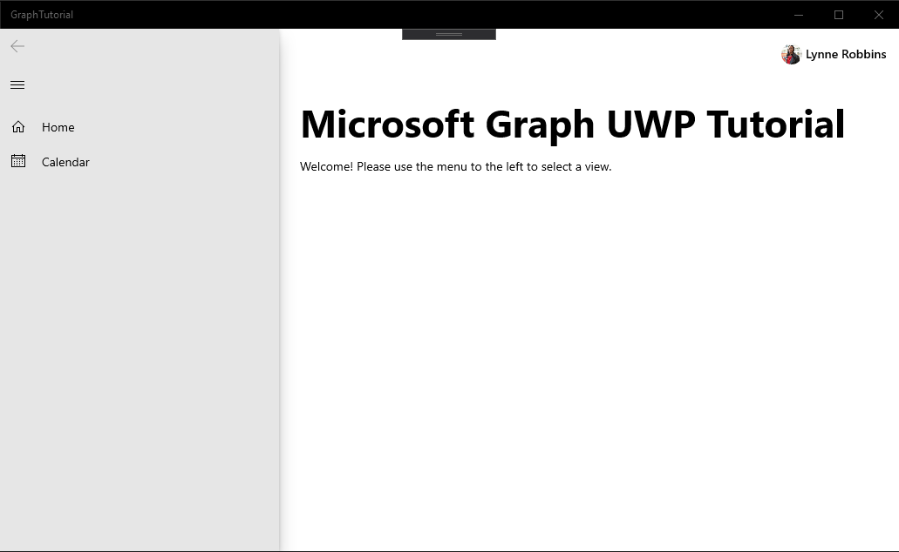

<!-- markdownlint-disable MD002 MD041 -->

在本练习中，你将扩展上一练习中的应用程序，以支持 Azure AD 的身份验证。 若要获取所需的 OAuth 访问令牌以调用 Microsoft Graph，这是必需的。 在此步骤中，将**LoginButton**控件从[Windows Graph 控件](https://github.com/windows-toolkit/Graph-Controls)集成到应用程序中。

1. 在 "解决方案资源管理器" 中右键单击 " **GraphTutorial** " 项目，然后选择 "**添加 > 新项 ...**"。选择 "**资源文件（resources.resw）**"，命名该`OAuth.resw`文件，然后选择 "**添加**"。 在 Visual Studio 中打开新文件时，请按如下所示创建两个资源。

    - **Name：** `AppId`， **Value：** 您在应用程序注册门户中生成的应用程序 ID
    - **Name：** `Scopes`， **Value：**`User.Read Calendars.Read`

    

    > [!IMPORTANT]
    > 如果您使用的是源代码管理（如 git），现在可以从源代码管理中排除`OAuth.resw`该文件，以避免无意中泄漏您的应用程序 ID。

## <a name="configure-the-loginbutton-control"></a>配置 LoginButton 控件

1. 打开`MainPage.xaml.cs`并将以下`using`语句添加到文件顶部。

    ```csharp
    using Microsoft.Toolkit.Graph.Providers;
    ```

1. 将现有的构造函数替换为以下项。

    :::code language="csharp" source="../demo/GraphTutorial/MainPage.xaml.cs" id="ConstructorSnippet":::

    此代码从`OAuth.resw`加载设置，并使用这些值初始化 MSAL 提供程序。

1. 现在， `ProviderUpdated` `ProviderManager`在上添加事件的事件处理程序。 将以下函数添加到 `MainPage` 类。

    :::code language="csharp" source="../demo/GraphTutorial/MainPage.xaml.cs" id="ProviderUpdatedSnippet":::

    当提供程序更改或提供程序状态更改时，此事件将触发。

1. 在 "解决方案资源管理器" 中，展开`HomePage.xaml.cs`"**主页. xaml** " 并打开。 将现有的构造函数替换为以下项。

    :::code language="csharp" source="../demo/GraphTutorial/HomePage.xaml.cs" id="ConstructorSnippet":::

1. 重新启动应用程序，并单击应用程序顶部的 "**登录**" 控件。 登录后，UI 应更改，以指示您已成功登录。

    

    > [!NOTE]
    > 该`ButtonLogin`控件实现为您存储和刷新访问令牌的逻辑。 令牌存储在安全存储中并根据需要进行刷新。
