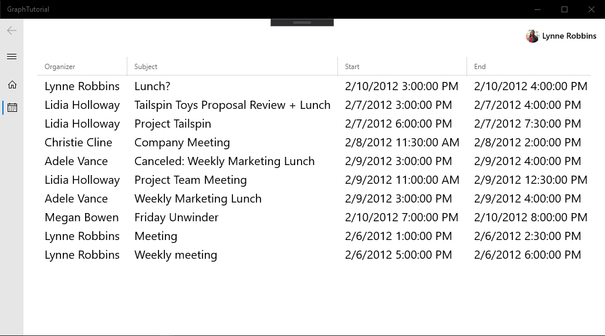

<!-- markdownlint-disable MD002 MD041 -->

<span data-ttu-id="d1ec3-101">在本练习中, 将把 Microsoft Graph 合并到应用程序中。</span><span class="sxs-lookup"><span data-stu-id="d1ec3-101">In this exercise you will incorporate the Microsoft Graph into the application.</span></span> <span data-ttu-id="d1ec3-102">对于此应用程序, 您将使用[microsoft graph 客户端库进行 .net](https://github.com/microsoftgraph/msgraph-sdk-dotnet)以调用 microsoft graph。</span><span class="sxs-lookup"><span data-stu-id="d1ec3-102">For this application, you will use the [Microsoft Graph Client Library for .NET](https://github.com/microsoftgraph/msgraph-sdk-dotnet) to make calls to Microsoft Graph.</span></span>

## <a name="get-calendar-events-from-outlook"></a><span data-ttu-id="d1ec3-103">从 Outlook 获取日历事件</span><span class="sxs-lookup"><span data-stu-id="d1ec3-103">Get calendar events from Outlook</span></span>

<span data-ttu-id="d1ec3-104">首先添加 "日历" 视图的新页面。</span><span class="sxs-lookup"><span data-stu-id="d1ec3-104">Start by adding a new page for the calendar view.</span></span> <span data-ttu-id="d1ec3-105">右键单击 "解决方案资源管理器" 中的 "**教程**" 项目, 然后选择 "**添加 > 新建项目 ...**"。选择 "**空白页**" `CalendarPage.xaml` , 在 "**名称**" 字段中输入, 然后选择 "**添加**"。</span><span class="sxs-lookup"><span data-stu-id="d1ec3-105">Right-click the **graph-tutorial** project in Solution Explorer and choose **Add > New Item...**. Choose **Blank Page**, enter `CalendarPage.xaml` in the **Name** field, and choose **Add**.</span></span>

<span data-ttu-id="d1ec3-106">打开`CalendarPage.xaml`并将以下行添加到现有`<Grid>`元素中。</span><span class="sxs-lookup"><span data-stu-id="d1ec3-106">Open `CalendarPage.xaml` and add the following line inside the existing `<Grid>` element.</span></span>

```xml
<TextBlock x:Name="Events" TextWrapping="Wrap"/>
```

<span data-ttu-id="d1ec3-107">打开`CalendarPage.xaml.cs`并将以下`using`语句添加到文件顶部。</span><span class="sxs-lookup"><span data-stu-id="d1ec3-107">Open `CalendarPage.xaml.cs` and add the following `using` statements at the top of the file.</span></span>

```cs
using Microsoft.Toolkit.Services.MicrosoftGraph;
using Microsoft.Toolkit.Uwp.UI.Controls;
using Newtonsoft.Json;
```

<span data-ttu-id="d1ec3-108">然后, 将以下函数添加到`CalendarPage`类中。</span><span class="sxs-lookup"><span data-stu-id="d1ec3-108">Then add the following functions to the `CalendarPage` class.</span></span>

```cs
private void ShowNotification(string message)
{
    // Get the main page that contains the InAppNotification
    var mainPage = (Window.Current.Content as Frame).Content as MainPage;

    // Get the notification control
    var notification = mainPage.FindName("Notification") as InAppNotification;

    notification.Show(message);
}

protected override async void OnNavigatedTo(NavigationEventArgs e)
{
    // Get the Graph client from the service
    var graphClient = MicrosoftGraphService.Instance.GraphProvider;

    try
    {
        // Get the events
        var events = await graphClient.Me.Events.Request()
            .Select("subject,organizer,start,end")
            .OrderBy("createdDateTime DESC")
            .GetAsync();

        // TEMPORARY: Show the results as JSON
        Events.Text = JsonConvert.SerializeObject(events.CurrentPage);
    }
    catch(Microsoft.Graph.ServiceException ex)
    {
        ShowNotification($"Exception getting events: {ex.Message}");
    }

    base.OnNavigatedTo(e);
}
```

<span data-ttu-id="d1ec3-109">考虑中`OnNavigatedTo`的代码执行操作。</span><span class="sxs-lookup"><span data-stu-id="d1ec3-109">Consider with the code in `OnNavigatedTo` is doing.</span></span>

- <span data-ttu-id="d1ec3-110">将调用的 URL 为`/v1.0/me/events`。</span><span class="sxs-lookup"><span data-stu-id="d1ec3-110">The URL that will be called is `/v1.0/me/events`.</span></span>
- <span data-ttu-id="d1ec3-111">`Select`函数将为每个事件返回的字段限制为仅供视图实际使用的字段。</span><span class="sxs-lookup"><span data-stu-id="d1ec3-111">The `Select` function limits the fields returned for each events to just those the view will actually use.</span></span>
- <span data-ttu-id="d1ec3-112">`OrderBy`函数按其创建日期和时间对结果进行排序, 最新项目最先开始。</span><span class="sxs-lookup"><span data-stu-id="d1ec3-112">The `OrderBy` function sorts the results by the date and time they were created, with the most recent item being first.</span></span>

<span data-ttu-id="d1ec3-113">在运行应用程序之前, 为了能够导航到此日历页, 请修改`NavView_ItemInvoked` `MainPage.xaml.cs`文件中的方法以替换`throw new NotImplementedException();`该行, 如下所示。</span><span class="sxs-lookup"><span data-stu-id="d1ec3-113">Just before running the app, in order to be able to navigate to this calendar page, modify the `NavView_ItemInvoked` method in the `MainPage.xaml.cs` file to replace the `throw new NotImplementedException();` line with as follows.</span></span>

```cs
case "calendar":
    RootFrame.Navigate(typeof(CalendarPage));
    break;
```

<span data-ttu-id="d1ec3-114">您现在可以运行应用程序, 登录, 然后单击左侧菜单中的 "**日历**" 导航项。</span><span class="sxs-lookup"><span data-stu-id="d1ec3-114">You can now run the app, sign in, and click the **Calendar** navigation item in the left-hand menu.</span></span> <span data-ttu-id="d1ec3-115">您应该会看到用户日历上的事件的 JSON 转储。</span><span class="sxs-lookup"><span data-stu-id="d1ec3-115">You should see a JSON dump of the events on the user's calendar.</span></span>

## <a name="display-the-results"></a><span data-ttu-id="d1ec3-116">显示结果</span><span class="sxs-lookup"><span data-stu-id="d1ec3-116">Display the results</span></span>

<span data-ttu-id="d1ec3-117">现在, 您可以将 JSON 转储替换为以用户友好的方式显示结果的内容。</span><span class="sxs-lookup"><span data-stu-id="d1ec3-117">Now you can replace the JSON dump with something to display the results in a user-friendly manner.</span></span> <span data-ttu-id="d1ec3-118">将全部内容替换为`CalendarPage.xaml`以下内容。</span><span class="sxs-lookup"><span data-stu-id="d1ec3-118">Replace the entire contents of `CalendarPage.xaml` with the following.</span></span>

```xml
<Page
    x:Class="graph_tutorial.CalendarPage"
    xmlns="http://schemas.microsoft.com/winfx/2006/xaml/presentation"
    xmlns:x="http://schemas.microsoft.com/winfx/2006/xaml"
    xmlns:local="using:graph_tutorial"
    xmlns:d="http://schemas.microsoft.com/expression/blend/2008"
    xmlns:mc="http://schemas.openxmlformats.org/markup-compatibility/2006"
    xmlns:controls="using:Microsoft.Toolkit.Uwp.UI.Controls"
    mc:Ignorable="d"
    Background="{ThemeResource ApplicationPageBackgroundThemeBrush}">

    <Grid>
        <controls:DataGrid x:Name="EventList" Grid.Row="1"
                AutoGenerateColumns="False">
            <controls:DataGrid.Columns>
                <controls:DataGridTextColumn
                        Header="Organizer"
                        Width="SizeToCells"
                        Binding="{Binding Organizer.EmailAddress.Name}"
                        FontSize="20" />
                <controls:DataGridTextColumn
                        Header="Subject"
                        Width="SizeToCells"
                        Binding="{Binding Subject}"
                        FontSize="20" />
                <controls:DataGridTextColumn
                        Header="Start"
                        Width="SizeToCells"
                        Binding="{Binding Start.DateTime}"
                        FontSize="20" />
                <controls:DataGridTextColumn
                        Header="End"
                        Width="SizeToCells"
                        Binding="{Binding End.DateTime}"
                        FontSize="20" />
            </controls:DataGrid.Columns>
        </controls:DataGrid>
    </Grid>
</Page>
```

<span data-ttu-id="d1ec3-119">这会将`TextBlock`替换替换`DataGrid`为。</span><span class="sxs-lookup"><span data-stu-id="d1ec3-119">This replaces the `TextBlock` with a `DataGrid`.</span></span> <span data-ttu-id="d1ec3-120">现在打开`CalendarPage.xaml.cs`并将`Events.Text = JsonConvert.SerializeObject(events.CurrentPage);`行替换为以下代码行。</span><span class="sxs-lookup"><span data-stu-id="d1ec3-120">Now open `CalendarPage.xaml.cs` and replace the `Events.Text = JsonConvert.SerializeObject(events.CurrentPage);` line with the following.</span></span>

```cs
EventList.ItemsSource = events.CurrentPage.ToList();
```

<span data-ttu-id="d1ec3-121">如果现在运行应用程序并选择日历, 则应获取数据网格中的事件列表。</span><span class="sxs-lookup"><span data-stu-id="d1ec3-121">If you run the app now and select the calendar, you should get a list of events in a data grid.</span></span> <span data-ttu-id="d1ec3-122">但是,**开始**和**结束**值以非用户友好方式显示。</span><span class="sxs-lookup"><span data-stu-id="d1ec3-122">However, the **Start** and **End** values are displayed in a non-user-friendly manner.</span></span> <span data-ttu-id="d1ec3-123">您可以使用[值转换器](https://docs.microsoft.com/uwp/api/Windows.UI.Xaml.Data.IValueConverter)控制这些值的显示方式。</span><span class="sxs-lookup"><span data-stu-id="d1ec3-123">You can control how those values are displayed by using a [value converter](https://docs.microsoft.com/uwp/api/Windows.UI.Xaml.Data.IValueConverter).</span></span>

<span data-ttu-id="d1ec3-124">右键单击 "解决方案资源管理器" 中的 "**教程**" 项目, 然后选择 "**添加 > 类 ...**"。命名该类`GraphDateTimeTimeZoneConverter.cs` , 然后选择 "**添加**"。</span><span class="sxs-lookup"><span data-stu-id="d1ec3-124">Right-click the **graph-tutorial** project in Solution Explorer and choose **Add > Class...**. Name the class `GraphDateTimeTimeZoneConverter.cs` and choose **Add**.</span></span> <span data-ttu-id="d1ec3-125">将文件的全部内容替换为以下内容。</span><span class="sxs-lookup"><span data-stu-id="d1ec3-125">Replace the entire contents of the file with the following.</span></span>

```cs
using Microsoft.Graph;
using System;

namespace graph_tutorial
{
    class GraphDateTimeTimeZoneConverter : Windows.UI.Xaml.Data.IValueConverter
    {
        public object Convert(object value, Type targetType, object parameter, string language)
        {
            DateTimeTimeZone date = value as DateTimeTimeZone;

            if (date != null)
            {
                // Resolve the time zone
                var timezone = TimeZoneInfo.FindSystemTimeZoneById(date.TimeZone);
                // Parse method assumes local time, which may not be the case
                var parsedDateAsLocal = DateTimeOffset.Parse(date.DateTime);
                // Determine the offset from UTC time for the specific date
                // Making this call adjusts for DST as appropriate
                var tzOffset = timezone.GetUtcOffset(parsedDateAsLocal.DateTime);
                // Create a new DateTimeOffset with the specific offset from UTC
                var correctedDate = new DateTimeOffset(parsedDateAsLocal.DateTime, tzOffset);
                // Return the local date time string
                return correctedDate.LocalDateTime.ToString();
            }

            return string.Empty;
        }

        public object ConvertBack(object value, Type targetType, object parameter, string language)
        {
            throw new NotImplementedException();
        }
    }
}
```

<span data-ttu-id="d1ec3-126">此代码采用由 Microsoft Graph 返回的[datetimetimezone type](https://developer.microsoft.com/en-us/graph/docs/api-reference/v1.0/resources/datetimetimezone)结构, 并将其分析`DateTimeOffset`为对象。</span><span class="sxs-lookup"><span data-stu-id="d1ec3-126">This code takes the [dateTimeTimeZone](https://developer.microsoft.com/en-us/graph/docs/api-reference/v1.0/resources/datetimetimezone) structure returned by Microsoft Graph and parses it into a `DateTimeOffset` object.</span></span> <span data-ttu-id="d1ec3-127">然后, 它将值转换为用户的时区并返回带格式的值。</span><span class="sxs-lookup"><span data-stu-id="d1ec3-127">It then converts the value into the user's time zone and returns the formatted value.</span></span>

<span data-ttu-id="d1ec3-128">打开`CalendarPage.xaml`并在`<Grid>`元素**前面**添加以下项。</span><span class="sxs-lookup"><span data-stu-id="d1ec3-128">Open `CalendarPage.xaml` and add the following **before** the `<Grid>` element.</span></span>

```xml
<Page.Resources>
    <local:GraphDateTimeTimeZoneConverter x:Key="DateTimeTimeZoneValueConverter" />
</Page.Resources>
```

<span data-ttu-id="d1ec3-129">然后, 将`Binding="{Binding Start.DateTime}"`行替换为以下代码行。</span><span class="sxs-lookup"><span data-stu-id="d1ec3-129">Then, replace the `Binding="{Binding Start.DateTime}"` line with the following.</span></span>

```xml
Binding="{Binding Start, Converter={StaticResource DateTimeTimeZoneValueConverter}}"
```

<span data-ttu-id="d1ec3-130">将`Binding="{Binding End.DateTime}"`行替换为以下代码行。</span><span class="sxs-lookup"><span data-stu-id="d1ec3-130">Replace the `Binding="{Binding End.DateTime}"` line with the following.</span></span>

```xml
Binding="{Binding End, Converter={StaticResource DateTimeTimeZoneValueConverter}}"
```

<span data-ttu-id="d1ec3-131">运行应用程序, 登录, 然后单击 "**日历**" 导航项。</span><span class="sxs-lookup"><span data-stu-id="d1ec3-131">Run the app, sign in, and click the **Calendar** navigation item.</span></span> <span data-ttu-id="d1ec3-132">您应该会看到 "**开始**" 和 "**结束**" 值格式化的事件的列表。</span><span class="sxs-lookup"><span data-stu-id="d1ec3-132">You should see the list of events with the **Start** and **End** values formatted.</span></span>


