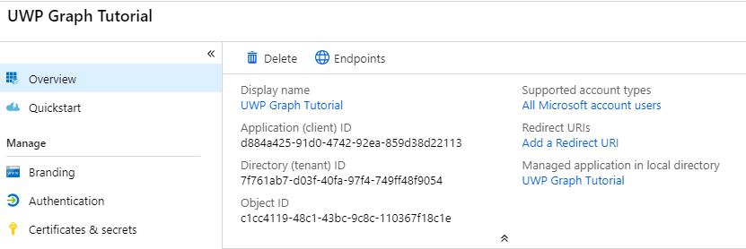

<!-- markdownlint-disable MD002 MD041 -->

在本练习中, 你将使用 Azure Active Directory 管理中心创建新的 Azure AD native 应用程序。

1. 打开浏览器，并转到 [Azure Active Directory 管理中心](https://aad.portal.azure.com)。然后，使用**个人帐户**（亦称为“Microsoft 帐户”）或**工作或学校帐户**登录。

1. 在左侧导航栏中选择 " **Azure Active Directory** ", 然后选择 "**管理**" 下的 "**应用程序注册**"。

    

1. 选择“新注册”****。 在“注册应用”**** 页上，按如下方式设置值。

    - 将“名称”**** 设置为“`UWP Graph Tutorial`”。
    - 将“受支持的帐户类型”**** 设置为“任何组织目录中的帐户和个人 Microsoft 帐户”****。
    - 保留“重定向 URI”**** 为空。

    

1. 选择“注册”****。 在**UWP Graph 教程**页上, 复制**应用程序 (客户端) ID**的值并保存它, 下一步将需要它。

    

1. 选择 "**添加重定向 URI** " 链接。 在 "**重定向 uri** " 页上, 找到 "**公共客户端 (移动、桌面)** " 部分的 "建议的重定向 uri" 部分。 选择 URI `urn:ietf:wg:oauth:2.0:oob` , 然后选择 "**保存**"。

    